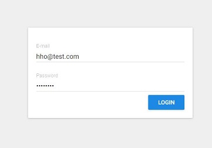
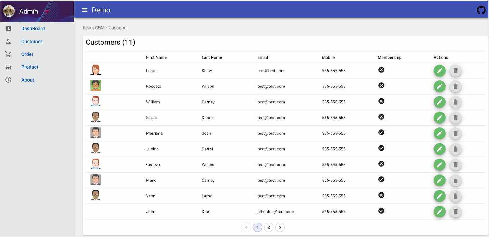
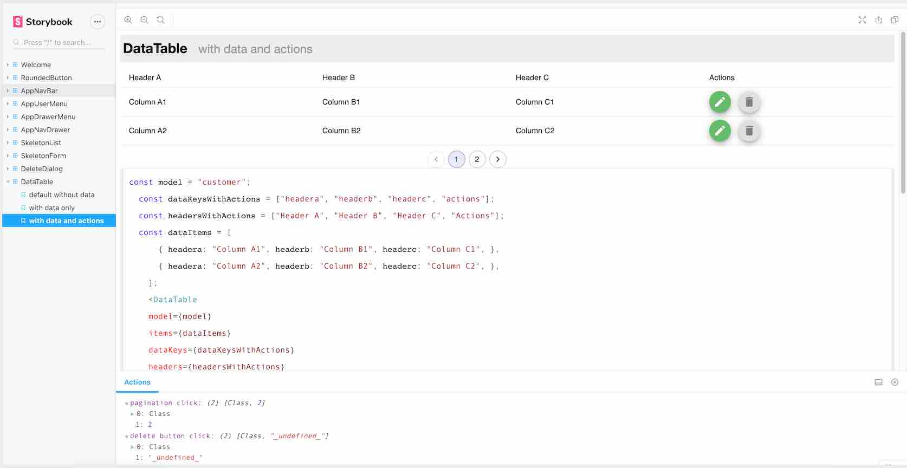

# mini crm cutom for demo propuses 

> A mini crm on  React 16, React-Redux & Material-UI 4

for demostration propuses this material is de show several skills that i got in react i participate in the original project call 
https://github.com/harryho/react-crm  but in separetly 

### Features

- This project is built on the top of React/Redux.
- The UI component are mainly built on Material-UI.
- This project uses Redux-Thunk to support back-end API.
- The backend API is just readonly dump service.
- Use Formik to manage the form submission
- Integrate with storybook for react.
- The project is built on TypeScript 3.x
- ~~Use Formsy to manage form submission~~


### Screenshots







----

Storybook
  



## Build Setup

```bash
# Clone project
git clone 


# install the packages with npm
npm install

# start the server with hot reload at localhost:4000
npm start
# or yarn
yarn start

# Storybook
## Start storybook
npm run storybook
## Build storybook
npm run build-storybook

## build for production
npm run build

```


## Docker 

```bash
## Run / Test release without building new image
npm run build

# Launch nginx image to test latest release
docker pull nginx:alpine
docker run -p 8080:80 -v \
    <your_aboslute_path>/dist:/usr/share/nginx/html nginx:alpine


# Build release image
docker build . -t  rc-prd:2.0

# Launch the development image in the backgroud
docker run -d --publish 8080:80  --name rc2 rc-prd:2.0

# Check the log
docker logs rc2  -f
```

#  deploy with CDK aws 

for deploy with that you need to have inside the aws cdk for node 

execute a 
#npm build 

for compile a package 


next you can run 

npm run cdk:deploy 

for run this into aws cloud 
